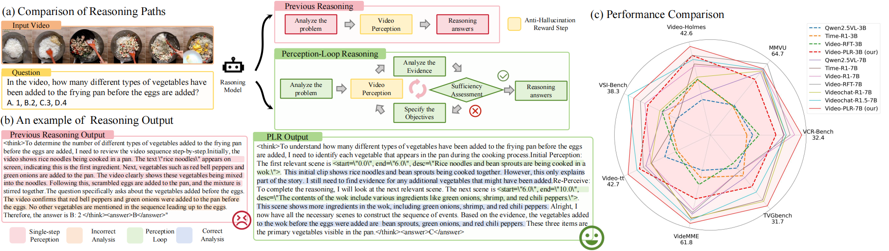
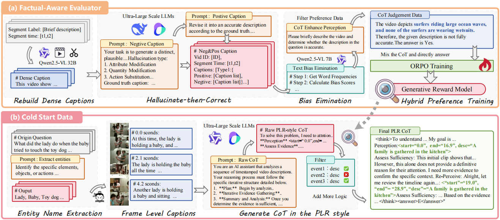

<div align="center">

# Alternating Perception-Reasoning for Hallucination-Resistant Video Understanding

**Bowei Pu**<sup>1</sup>, **Chuanbin Liu**<sup>1</sup>, **Yifan Ge**<sup>1</sup>, **Peichen Zhou**<sup>1</sup>, **Yiwei Sun**<sup>1</sup>, **Zhiyin Lu**<sup>1</sup>, **Jiankang Wang**<sup>1</sup>, **Hongtao Xie**<sup>1</sup>

<sup>1</sup>University of Science and Technology of China (USTC)

[[📄 Paper](https://arxiv.org/abs/2511.18463)] [[🤗 Model](https://huggingface.co/collections/pbwpbw/video-plr/)] [[📚 Dataset](https://huggingface.co/)] [[🚀 Demo](https://huggingface.co/spaces/)]

</div>

## 🚩 News & TODO List

- [x] Upload paper to arXiv.
- [ ] Release SFT data to HuggingFace.
- [x] Release trained models.
- [ ] Create a model demo on HuggingFace Spaces.
- [ ] Release training code (based on ms-swift).
- [ ] Finding a home for the paper (Accepted by a conference 🙏).

---

## 📖 Introduction & Advantages



Existing Video Large Language Models (VideoLLMs) often suffer from **perception shortcuts** and **hallucinations** due to a flawed single-step perception paradigm. They tend to describe the video once and then reason, leading to insufficient evidence and lost details.

To address this, we introduce **VideoPLR**, a novel framework that integrates a loop-based paradigm with an anti-hallucination reward.

### Key Advantages:
1.  **Perception Loop Reasoning (PLR) Paradigm:** Unlike traditional "Think-then-Answer" models, VideoPLR explicitly decouples perception and reasoning. The model iteratively perceives video segments, analyzes the evidence, and autonomously decides whether to re-perceive or conclude.
2.  **Anti-Hallucination Mechanism:** We introduce the **Factual-Aware Evaluator (FAE)**, a reward model that evaluates the consistency between text descriptions and video content to prevent hallucinations during Reinforcement Learning (RL).
3.  **State-of-the-Art Performance:** VideoPLR achieves SOTA results on 7 benchmarks (including Video-Holmes, MMVU, and VideoMME) at both 3B and 7B parameter scales, demonstrating superior data efficiency.

---
##  ✨ Magic Prompt
Use it after the question text!
```python
The assistant first briefly thinks through the reasoning process with evidence and then provides the user with the answer.
Within the <think></think> tags, the assistant provides reasoning with structured visual evidence: <start="t1", end="t2", desc="briefly explains the evidence">.
The assistant should iteratively find visual evidence, evaluate whether it is sufficient to answer the question, and conclude the thinking process after multiple loops. Then, provide the answer within the <answer></answer> tags.
```

## 📚 Data Characteristics

We construct two novel datasets to support the PLR paradigm and anti-hallucination training:

### 1. VideoPLR-14K (Cold-Start Data)
Designed to bootstrap the model to generate responses in the PLR format. It includes:
* **Sequential Causal Reasoning:** Based on NextQA, re-annotated with timestamps and reasoning steps.
* **Non-Sequential Segment Ordering:** Based on ActivityNet, focused on reordering disordered events.
* **Format:** Structured as `Perception -> Assess Evidence -> Re-Perceive -> Conclusion`.

### 2. AnetHallu-117K (Preference Data)
A large-scale hallucination judgment preference dataset used to train the Factual-Aware Evaluator (FAE).
* **Source:** Constructed from human-annotated ActivityNet.
* **Structure:** Contains 5 types of hallucinations (Attribute, Quantity, Action, Detail, Temporal) and hybrid Chain-of-Thought (CoT) binary classification preference data.
* **Quality:** The FAE trained on this data performs comparably to GPT-4o in evaluating text-video consistency.



---

## 🤖 Model & Training

VideoPLR is built upon **Qwen2.5-VL** and trained using **Group Relative Policy Optimization (GRPO)**.

### Training Phases:
1.  **Cold Start (SFT):** The model is fine-tuned on **VideoPLR-14K** and other image CoT data to learn the iterative perception format.
2.  **Reinforcement Learning (GRPO):** The model is optimized using a composite reward function designed to ensure accurate reasoning and reduce hallucinations.

### Reward Design:
* **Format Rewards:** Ensures the output follows the `<think>...</think>` and `<start=...>` structures.
* **Accuracy Reward:** Evaluates correctness on tasks like Multiple Choice, Temporal Grounding (IoU), and Open-Ended QA.
* **Anti-Hallucination Reward:** Uses the **Factual-Aware Evaluator (FAE)** to score the factual accuracy of the generated video descriptions (evidence).

---

## 🛠️ Usage

*Coming Soon*

---

## 🙏 Acknowledgements

We would like to sincerely thank the **ms-swift** team for their excellent training framework.

> **[modelscope/ms-swift](https://github.com/modelscope/ms-swift)**
---

## ✏️ Citation

If you find our paper or code useful, please cite:

```bibtex
@misc{pu2025alternatingperceptionreasoninghallucinationresistantvideo,
      title={Alternating Perception-Reasoning for Hallucination-Resistant Video Understanding}, 
      author={Bowei Pu and Chuanbin Liu and Yifan Ge and Peichen Zhou and Yiwei Sun and Zhiyin Lu and Jiankang Wang and Hongtao Xie},
      year={2025},
      eprint={2511.18463},
      archivePrefix={arXiv},
      primaryClass={cs.CV},
      url={[https://arxiv.org/abs/2511.18463](https://arxiv.org/abs/2511.18463)}, 
}